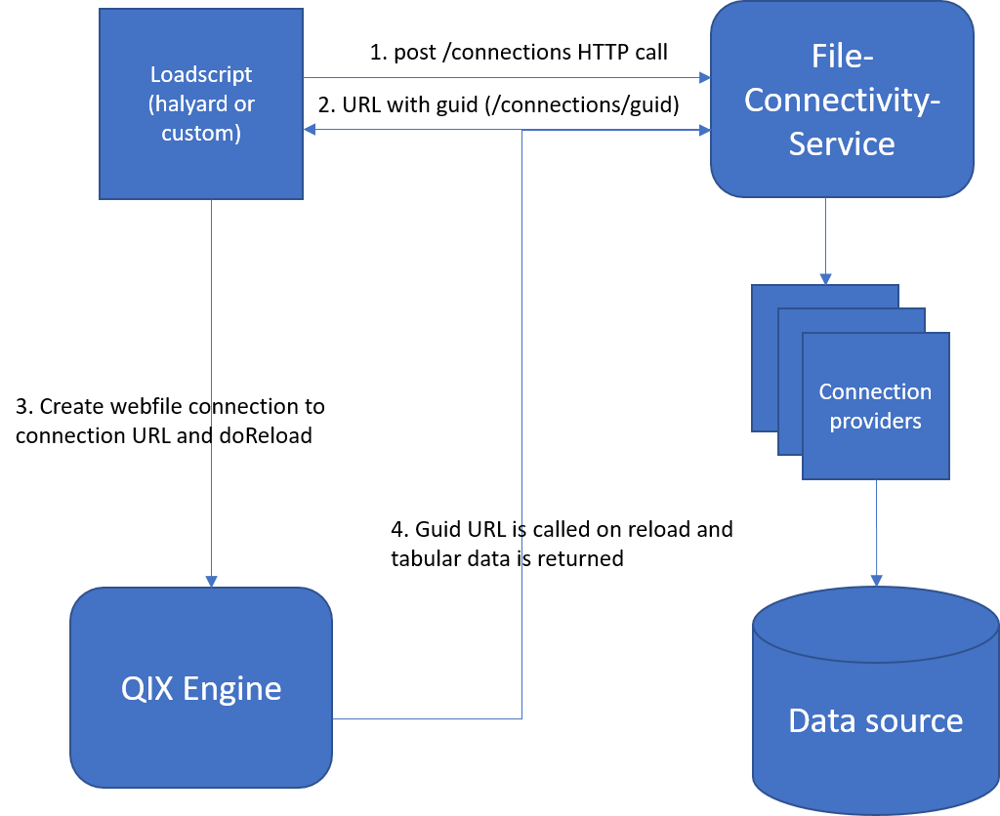

# Outhaul

[](https://circleci.com/gh/qlik-ea/outhaul)

## Overview

Outhaul is a service built to simplify accessing protected data sources. A connection strategy is registered in Outhaul and an unique HTTP endpoint is defined. 
The unique HTTP endpoint received is used to access the data source. Outhaul is well suited to handle the standard authentication workflows that requires user involvement like OAuth2. 

The main purpose of the connection strategy is to access the data source. The data on the data source can be of any kind. The connection strategy needs to transform the data if is not in a tabular format suited for QIX Engine.
A data source could be protected with authentication like OAuth2. Outhaul will define the required HTTP endpoint by its connection strategies to authentication their data source. 




## Contributing

Contributions are welcome and encouraged! See more info at [Open Source at Qlik R&D](https://github.com/qlik-oss/open-source).

## Development

### Editor/IDE Configuration

No particular editor or IDE is assumed. The repo root contains an [.editorconfig](./.editorconfig) file for editors that support it. If not, make sure that the used editor is configured accordingly.

### Coding Guidelines

JavaScript code shall be developed according the [Airbnb JavaScript Style Guide](https://github.com/airbnb/javascript).

The [eslintrc.json](./eslintrc.json) file incorporates these rules with minor modifications.

### Linting

To run linting locally run:

```sh
npm run lint
```

### Testing

Component tests can be run with:

```sh
npm run test:component
```

### CircleCI

Linting, building and testing is part of a job pipeline in CircleCI, and is also a prerequisite for merging a PR to master.
